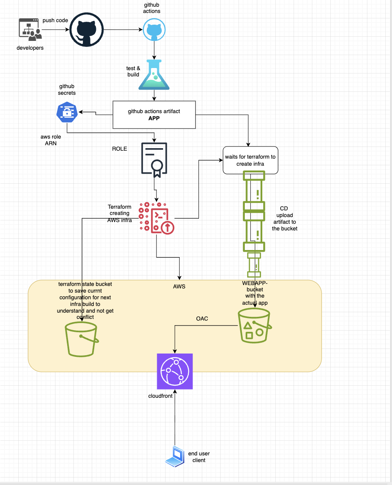

# Terraform CI/CD Lab

React landing page deployed to AWS via a three-stage GitHub Actions pipeline. Infrastructure provisioned with Terraform.

## Stack

- **App**: React + Vite (TypeScript)
- **Infra**: S3 (private) + CloudFront + OAC
- **Auth**: GitHub Actions OIDC — no AWS keys
- **State**: Terraform remote state in S3
- **Pipeline**: CI → Terraform → CD

## Architecture



## Pipeline

```
git push main
  │
  ├─ CI          lint → build → upload artifact
  │
  ├─ Terraform   create infra (idempotent — imports existing resources)
  │
  └─ CD          download artifact → s3 sync → CloudFront invalidation
```

## AWS Components

| Component | What it does |
|---|---|
| `webapp-bucket-toni7891` | Stores the React build. Fully private — no public access. |
| Origin Access Control | Signs CloudFront → S3 requests (SigV4). Users can only reach files through CloudFront. |
| CloudFront distribution | HTTPS termination, global caching, serves `index.html` as default root. |
| `tf-state-toni7891` | Terraform remote state. Created automatically by the pipeline on first run. |
| IAM OIDC Provider | Trusts `token.actions.githubusercontent.com` — lets GitHub Actions runners get temporary AWS credentials. |
| `github-actions-role` | Role assumed by CI/CD runners. Scoped to this repo only via condition on `sub` claim. |

## Bootstrap (one time)

You need the IAM role before the pipeline can run Terraform — so create it manually first:

```bash
cd terraform
terraform init
terraform apply \
  -target=aws_iam_openid_connect_provider.github \
  -target=aws_iam_role.github_actions \
  -target=aws_iam_role_policy.github_actions
```

Copy the output ARN → add to GitHub as secret `AWS_ROLE_ARN`:
`Settings → Secrets and variables → Actions → New repository secret`

After that, every push to `main` runs the full pipeline automatically.

## Local dev

```bash
cd app
npm ci
npm run dev     # http://localhost:5173
npm run build   # output → app/dist/
```

## Live URL

**https://dl1o7om2wgxsw.cloudfront.net**
